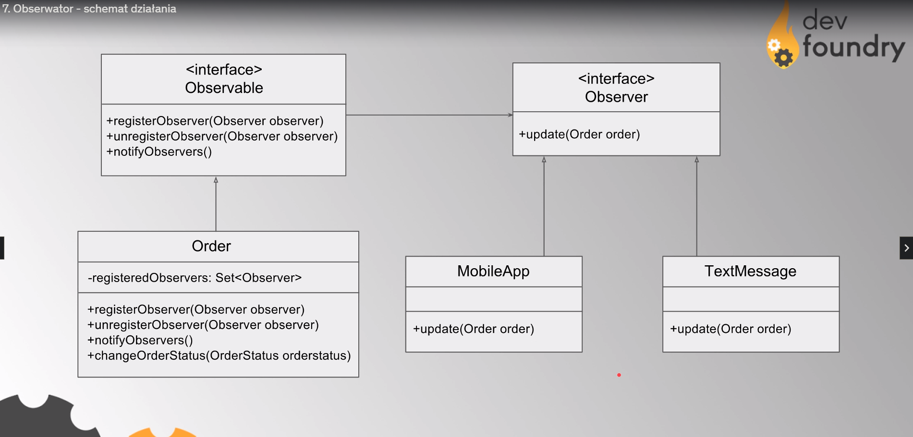

Musi zaimplementować dwa interfejsy: **Observer** i **Observable**

Observable implementuje klasa w której zmiany chcemy śledzić, obserwować. Natomiast Observer implementuje każda klasa która ma dostać notyfikację o zmianie stanu obiektu obserwowanego.

Klasa Order posiada kolekcje obserwatorów. Dzieki metodą registerObserver i unregisterObserver może dodawać albo usuwać obserwatorów. Domenową metodą tutaj jest changeOrderStatus - po zmianie statusu wywoałna zostanie metoda notifyObservers która za pomoca metody update interfejsu Observer przekaze każdemu obiektowi zmieniony obiekt zamowienia

**ZALETY**
- stosowany zawsze w relacji 1:n , gdy wiele obiektów ma być informowane o zmianie obiektu bazowego
- idealny jeśli w aplikacji obserwujemy coś co zmienia się w czasie
- JDK samo wspiera tez wzorzec,  dając interfejs Observer i klase abstrakcyjną Observable
- jest prosty w implementacji i elastyczny
- nie ma ścisłego powiązania między obsewatorem o obiektem obserwowanym - dzięki temu możemy dowolnie rozbudowywać implementacje obu stron

**MINUSY**

-  korzystając z implementacji jdk nie możemy już rozszerzyc obiektu o inne klasy, bo Observable jest klasa ktora już jest rozszerzana
-  korzystajac z implementacji jdk nie mamy wpływu na kolejność notyfikacji obserwatorów 
