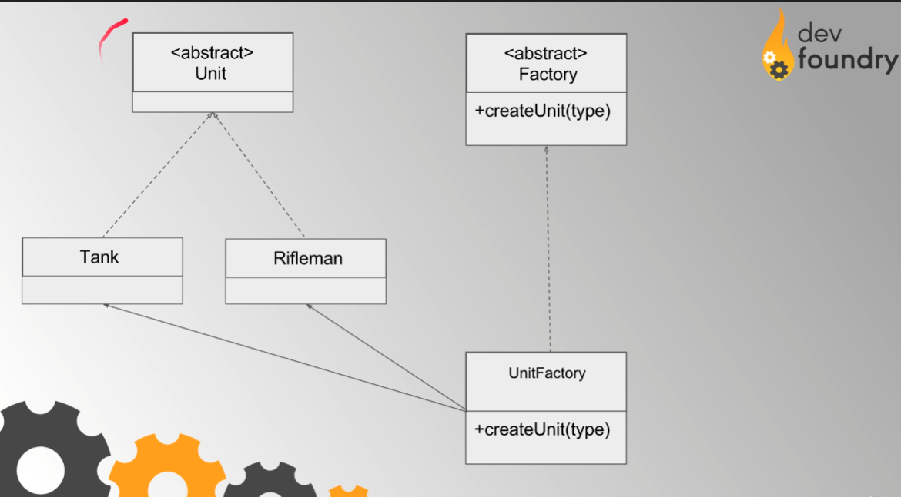

Metoda wytwórcza definiuje metodę która ma służyć tworzeniu obiektów bez bezpośredniego wywoływania konstruktora (poprzez operator new). Podklasy mogą nadpisać tę metodę w celu zmiany klasy tworzonych obiektów.

Metoda wytwórcza jest kreacyjnym wzorcem projektowym rozwiązującym problem tworzenia obiektów-produktów bez określania ich konkretnych klas.

Metoda wytwórcza definiuje metodę która ma służyć tworzeniu obiektów bez bezpośredniego wywoływania konstruktora (poprzez operator new). Podklasy mogą nadpisać tę metodę w celu zmiany klasy tworzonych obiektów.

____

**ZALETY:**

-  Unikasz ścisłego sprzęgnięcia pomiędzy twórcą a konkretnymi produktami.
- Zasada pojedynczej odpowiedzialności. Możesz przenieść kod kreacyjny produktów w jedno miejsce programu, ułatwiając tym samym utrzymanie kodu.
- Zasada otwarte/zamknięte. Możesz wprowadzić do programu nowe typy produktów bez psucia istniejącego kodu klienckiego.

**WADY** 
- Kod może się skomplikować, ponieważ aby zaimplementować wzorzec, musisz utworzyć liczne podklasy. W najlepszej sytuacji wprowadzisz ów wzorzec projektowy do już istniejącej hierarchii klas kreacyjnych.

____

_Stosuj Metodę Wytwórczą gdy nie wiesz z góry jakie typy obiektów pojawią się w twoim programie i jakie będą między nimi zależności._

_Korzystaj z Metody wytwórczej gdy chcesz oszczędniej wykorzystać zasoby systemowe poprzez ponowne wykorzystanie już istniejących obiektów, zamiast odbudowywać je raz za razem._
